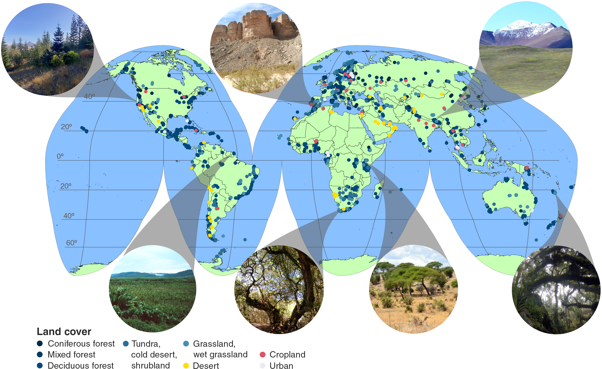

# Connecting the multiple dimensions of global soil fungal diversity

How the multiple facets of soil fungal diversity vary worldwide remains virtually unknown, 
hindering the management of this essential species-rich group. 
By sequencing high-resolution DNA markers in over 4000 topsoil samples 
from natural and human-altered ecosystems across all continents, 
we illustrate the distributions and drivers of different levels of 
taxonomic and phylogenetic diversity of fungi and their ecological groups. 
We show the impact of precipitation and temperature interactions on fungal 
local species richness (_alpha diversity_) across different climates. 
Our findings reveal how temperature drives fungal compositional turnover (_beta diversity_) 
and phylogenetic diversity, linking them with regional species richness (_gamma diversity_). 
Our work integrates fungi into the principles of global biodiversity distribution 
and presents detailed maps for biodiversity conservation and modeling of global ecological processes.  

## Geographic distribution of study sites

  

The map, presented in Goode's homolosine projection, 
shows the exact locations where the research was conducted, each marked by a dot. 
The different colors of the dots signify various types of land cover. 
Inset photos, captured by 
[Dr. Sten Anslan](https://sisu.ut.ee/mmc/members?lang=en) and 
[Dr. Sergei Põlme](https://sisu.ut.ee/mmc/members?lang=en), 
provide visual representation of some of these sampling sites.  

The Global Soil Mycobiome consortium ([**GSMc**](https://GSMc-fungi.github.io/)) dataset (Tedersoo et al., 2021) 
was the basis for the analysis of taxonomic and phylogenetic alpha, beta, and gamma diversities conducted. 
This dataset comprises fungal sequence data from >125,000 samples at 3200 study sites 
collected from all continents in 2010-2019 following strict sampling and analytical protocols. 
In short, 40 soil cores (5 cm in diameter and 5 cm depth) were collected from a 
2500 m2 area at each study site and were pooled. 
For gamma diversity and validation of alpha diversity analyses, 
we used the data from five additional global surveys applying comparable sampling protocols: 
**BIODESERT** (249 samples) exploring dryland ecosystem response to grazing pressure and climate change (Maestre et al. 2022); 
**MUSGONET** and **CLIMIFUN** (290 samples) (Guerra et al. 2022); 
**GlobalAM** (199 samples), assessing arbuscular mycorrhizal fungal diversity worldwide (Davison et al. 2021); 
and **GlobalWetlands** (Bahram et al., 2022) (85 samples).  

## Data availability

All the data used in this study are openly accessible and have been deposited at: 
- **Zenodo** (large georeferenced rasters and shapefiles with biodiversity estimates) [**DOI:10.5281/zenodo.8013448**](https://zenodo.org/record/8013448)  
- **PlutoF** biodiversity management platform (the curated DNA sequences and species occurrence data): 
  [https://plutof.ut.ee/](https://plutof.ut.ee/)  
- The European Nucleotide Archive (**ENA**) at EMBL-EBI under accession number **PRJEB63550** (raw sequencing data)  

## MMC

Mycology and Microbiology Center (MMC): [https://sisu.ut.ee/mmc/](https://sisu.ut.ee/mmc/home-1?lang=en)  
